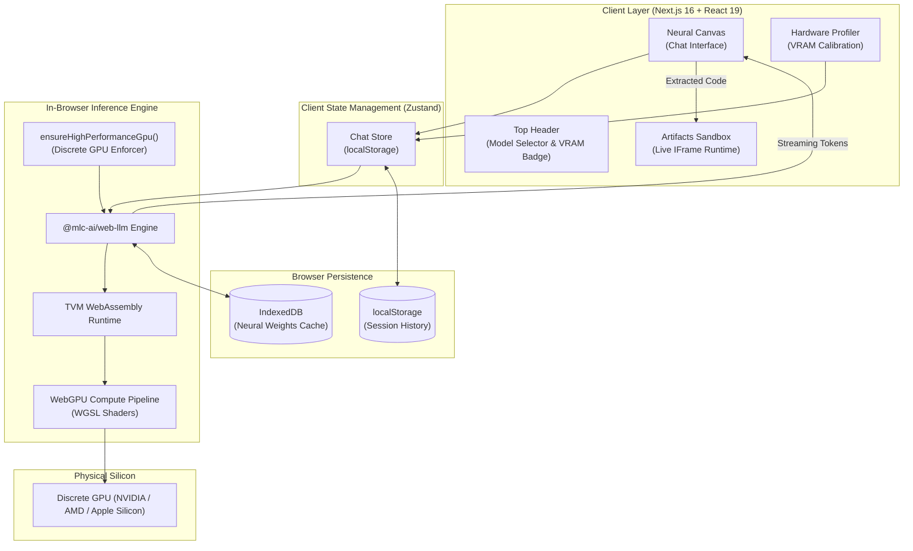

# BetaBrain // In-Browser Local AI Engine

<div align="center">


### A cinematic, zero-latency, 100% private AI software architect that executes entirely on your local GPU inside the browser.

[](https://nextjs.org/)
[](https://react.dev/)
[](https://www.w3.org/TR/webgpu/)
[](https://webllm.mlc.ai/)
[](https://tailwindcss.com/)
[](LICENSE)
[](#the-why-true-local-intelligence)

[Explore Features](#signature-features) • [Hardware Calibration](#hardware-profiler--calibration) • [Quickstart](#getting-started) • [Desktop Build](#desktop-application-electron) • [Architecture](#system-architecture)

</div>

---

## The "Why": True Local Intelligence

Most modern "AI clients" are thin API wrappers that forward prompts to centralized cloud datacenters—charging monthly subscriptions, incurring network latency, and storing private code on third-party servers.

**BetaBrain is fundamentally different.** 

BetaBrain is an enterprise-grade AI software builder that runs **100% in-browser on client silicon**. Powered by **WebGPU** and **`@mlc-ai/web-llm`**, quantized neural weights (such as Qwen 2.5 Coder and Llama 3.1) are executed directly on your dedicated graphics hardware via compute shaders, then cached locally in browser **IndexedDB**. 

* **Zero Cloud Latency:** No HTTP round-trips to external model inference APIs.
* **100% Air-Gapped Privacy:** Your prompts, proprietary source code, and telemetry never leave your machine.
* **Zero Subscription Fees:** No API keys, usage quotas, or billing meters.
* **Persistent Offline Caching:** Once weights are downloaded to IndexedDB, BetaBrain runs entirely offline without internet access.

---

## The "Clinical White Lab" Aesthetic

BetaBrain diverges from dark, terminal-heavy hacker cliches. The interface is styled around **The Clean Room**—a hyper-modern, sterile laboratory aesthetic with:
* High-breathability pure white surfaces (`#FFFFFF`) and pristine zinc canvases (`#F7F7F9`).
* Crisp surgical borders (`#E4E4E7`) with soft, clinical drop shadows.
* Electric surgical blue accents (`#0055FF`) signifying active compute and data transfer.
* JetBrains Mono micro-typography tracking hardware concurrency, token rates, and latency.

---

## Signature Features

### ⚡ 100% Client-Side WebGPU Acceleration
Direct hardware execution via WebGPU WGSL compute shaders. BetaBrain forces `powerPreference: "high-performance"` to guarantee your operating system routes matrix operations to dedicated discrete GPUs (NVIDIA RTX / AMD Radeon / Apple Silicon) rather than falling back to low-power integrated graphics.

### 🧪 The Artifacts Sandbox (Live Code Execution)
BetaBrain doesn't just generate code—it executes and previews it in real time. 
* **Live DOM Runtime:** Interactive HTML5, CSS3, JavaScript, SVG, and React UI components are automatically extracted from streaming output and executed inside an isolated split-screen iframe sandbox.
* **Multi-Device Responsive Stage:** Toggle viewport widths between Desktop (100%), Tablet (768px), and Mobile (375px) to test prototype responsiveness instantly.
* **Inspector & Code Exporter:** Switch between the live interactive preview and syntax-highlighted source code with one-click clipboard copying.

### 🔬 Hardware Profiler & VRAM Calibration
Browsers cannot read physical GPU VRAM directly. BetaBrain features a dedicated **Hardware Profiler** onboarding modal with conservative fallback estimation:
* Automatically profiles CPU threads (`navigator.hardwareConcurrency`) and system RAM (`navigator.deviceMemory`).
* Applies conservative VRAM mapping (e.g., 16GB System RAM maps to a safe 6GB VRAM tier, matching common configurations like RTX 3050/4050 mobile).
* Automatically filters and recommends the optimal coding model to prevent browser memory exhaustion.

### 🗂️ Collapsible Full-Screen Neural Canvas
* The left "Workspace Archives" sidebar is fully collapsible via a sleek panel toggle in the header.
* Smooth Framer Motion spring physics smoothly tween sidebar width between `320px` and `0px`.
* When collapsed, the central chat stage fluidly expands to occupy **100% of the viewport**, providing an immersive software architecture workspace.

### 🛡️ Zero-Database Air-Gapped Persistence
* Session history, workspace tabs, and user configuration are managed through reactive client-side Zustand stores backed by `localStorage`.
* No database setup, no cloud syncing, no telemetry tracking.

---

## Supported Model Roster

BetaBrain features a dynamic Tiered Model Selector categorized by dedicated GPU memory requirements:

| Tier | Tier Name | Model Identifier | Parameters | Download | VRAM Target | Primary Capability |
| :---: | :--- | :--- | :---: | :---: | :---: | :--- |
| **1** | Fast & Light | `Qwen2.5-Coder-1.5B-Instruct-q4f16_1-MLC` | 1.54B | ~1.3 GB | **4GB - 6GB** | Algorithmic code, reactive UI components, HTML widgets |
| **1** | Fast & Light | `Phi-3-mini-4k-instruct-q4f16_1-MLC` | 3.82B | ~2.4 GB | **6GB** | Microsoft dense architecture, conversational logic |
| **1** | Fast & Light | `Qwen2-1.5B-Instruct-q4f16_1-MLC` | 1.54B | ~1.2 GB | **4GB** | Ultra-fast lightweight conversational reasoning |
| **2** | Balanced | `Qwen2.5-Coder-7B-Instruct-q4f16_1-MLC` | 7.61B | ~4.7 GB | **8GB - 12GB** | Full-stack software architecture, complex refactors |
| **2** | Balanced | `Llama-3.1-8B-Instruct-q4f16_1-MLC` | 8.03B | ~4.9 GB | **8GB - 12GB** | Meta open-weight flagship, deep conversational intelligence |
| **2** | Balanced | `Mistral-7B-Instruct-v0.3-q4f16_1-MLC` | 7.25B | ~4.4 GB | **8GB - 12GB** | High-efficiency general reasoning |
| **3** | Heavy Duty | `gemma-2-9b-it-q4f16_1-MLC` | 9.24B | ~5.8 GB | **16GB** | Google deep reasoning, extended context |
| **3** | Heavy Duty | `Qwen2-7B-Instruct-q4f16_1-MLC` | 7.61B | ~4.6 GB | **16GB** | Heavyweight coding synthesis |
| **4** | Frontier Lab | `Llama-3.1-70B-Instruct-q4f16_1-MLC` | 70.6B | ~38.0 GB | **24GB+** | Enterprise workstation frontier intelligence |

---

## System Architecture



---

## Getting Started

### Prerequisites
* A WebGPU-compatible modern browser:
  * **Google Chrome** (v113+)
  * **Microsoft Edge** (v113+)
  * **Brave** / **Arc** with hardware acceleration enabled.
* **Node.js** (v18.17+ or v20+)
* A dedicated GPU (recommended: 4GB+ VRAM for Tier 1 models).

### Installation

1. **Clone the Repository:**
   ```bash
   git clone https://github.com/ManojDevHub1/BetaBrain.git
   cd BetaBrain
   ```

2. **Install Dependencies:**
   ```bash
   npm install
   ```

3. **Launch the Development Server:**
   ```bash
   npm run dev
   ```

4. **Open in Browser:**
   Navigate to [http://localhost:3000](http://localhost:3000).

### The "Crystalline Fill" Onboarding
Upon launching BetaBrain for the first time or switching to a new model:
1. The **Crystalline Fill** modal activates, featuring a thin-stroked geometric progress chamber.
2. Model weight shards are downloaded directly from Hugging Face and cached into your browser's **IndexedDB**.
3. Real-time telemetry monitors exact download throughput and progress percentage.
4. Once completed, weights remain cached permanently for zero-latency, instant subsequent startups.

---

## Desktop Application (Electron)

BetaBrain can be packaged as a standalone, native desktop application for Windows (`.exe`), sandboxed with strict security controls:

### Hardened Electron Security Features
* **Context Isolation:** `contextIsolation: true` prevents renderer process tampering.
* **Node Integration Disabled:** `nodeIntegration: false` mitigates Remote Code Execution (RCE) vectors.
* **Process Sandboxing:** OS-level Chromium process sandboxing enabled.
* **Dual-Layer CSP:** Strict Content Security Policy enforced in HTML `<meta>` tags and network session headers.
* **Discrete GPU Switch:** Injects `--force_high_performance_gpu` and `--gpu-preference=2` at the Chromium command line to guarantee dedicated GPU binding on dual-GPU laptops.

### Build Executables

```bash
# 1. Compile the Next.js static production export
npm run build

# 2. Package standalone Windows installer and portable binary
npm run electron:dist
```

Output binaries are placed in `dist/`:
* `dist/BetaBrain-1.0.0-x64.exe` (NSIS Full Windows Installer)
* `dist/BetaBrain-1.0.0-portable.exe` (Zero-Install Standalone Executable)
* `dist/win-unpacked/BetaBrain.exe` (Direct Unpacked Binary)

---

## Tech Stack & Dependencies

* **Framework:** [Next.js 16](https://nextjs.org/) (App Router, Turbopack, Static Export)
* **Library:** [React 19](https://react.dev/)
* **AI Runtime:** [`@mlc-ai/web-llm`](https://github.com/mlc-ai/web-llm) (WebGPU Machine Learning Compilation)
* **Styling:** [Tailwind CSS v4](https://tailwindcss.com/) with CSS-first design tokens
* **Animations:** [Motion for React](https://motion.dev/) (Framer Motion v12)
* **Smooth Scrolling:** [Lenis](https://lenis.darkroom.engineering/)
* **State Management:** [Zustand v5](https://github.com/pmndrs/zustand) with localStorage persistence
* **Syntax Highlighting:** [Highlight.js](https://highlightjs.org/)
* **Desktop Wrapper:** [Electron](https://www.electronjs.org/) & [Electron Builder](https://www.electron.build/)

---

## Developer & Creator Credits

Developed with precision by **Manoj in Beta** as part of a high-utility engineering series dedicated to building privacy-first, edge-native developer tooling.

* **GitHub:** [@ManojDevHub1](https://github.com/ManojDevHub1)
* **Project:** [BetaBrain Repository](https://github.com/ManojDevHub1/BetaBrain)

---

## License

This project is licensed under the **MIT License** — see the [LICENSE](LICENSE) file for details.
# betabrain

